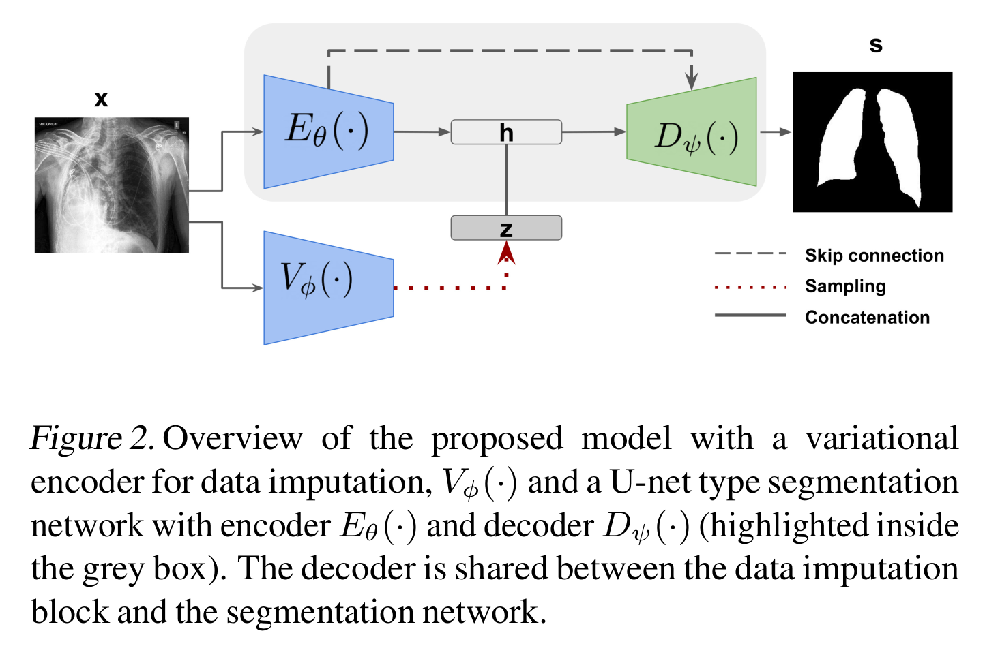

# README #

This is the official Pytorch implementation of 
"[Lung Segmentation from Chest X-rays using Variational Data Imputation](https://arxiv.org/abs/2005.10052)", Raghavendra Selvan et al. 2020


### What is this repository for? ###

* Predict lung masks from CXRs
* Model is trained to predict on *PA/AP* views
* Train the models described in the paper
* v1.0

### How do I get set up? ###

* Basic Pytorch dependency
* Tested on Pytorch 1.3, Python 3.6 
* Predict using the pretrained model: 
python predict.py --data DATA_DIR --model saved_models/lungVAE.pt
* Download preprocessed CXR data [from here](https://drive.google.com/open?id=1_rWIRBF9o6VE6v8upf4nTrZmZ1Nw9fbD)
* Train the model from scratch: 
python train.py --data DATA_DIR


### Using preprocessed diffused masks
* For speed up, the diffused noise masks are precomputed 
* 200 sample masks are provided in this [file](https://drive.google.com/open?id=1j7BYeX7ll0JIfYHSReLB95dojZYSwboK)
* Check the [dataloader](https://github.com/raghavian/lungVAE/blob/master/data/dataset.py) to create more or to compute the masks on the fly
* It is recommended to use precomputed masks

### Usage guidelines ###

* Kindly cite our publication if you use any part of the code
```
@misc{raghav2020lungVAE,
 	title={Lung Segmentation from Chest X-rays using Variational Data Imputation},
	author={Raghavendra Selvan and Erik B. Dam and Nicki Skafte Detlefsen and Sofus Rischel and Kaining Sheng and Mads Nielsen and Akshay Pai},
	howpublished={ICML Workshop on The Art of Learning with Missing Values},
	month={July},
 	note={arXiv preprint arXiv:2020.2005.10052},
	year={2020}}
```

### Who do I talk to? ###

* raghav@di.ku.dk

### Thanks 
* For the Kaggle [data](https://www.kaggle.com/kmader/pulmonary-chest-xray-abnormalities)
*    Jaeger S, Karargyris A, Candemir S, Folio L, Siegelman J, Callaghan F, Xue Z, Palaniappan K, Singh RK, Antani S, Thoma G, Wang YX, Lu PX, McDonald CJ. Automatic tuberculosis screening using chest radiographs. IEEE Trans Med Imaging. 2014 Feb;33(2):233-45. doi: 10.1109/TMI.2013.2284099. PMID: 24108713
*    Candemir S, Jaeger S, Palaniappan K, Musco JP, Singh RK, Xue Z, Karargyris A, Antani S, Thoma G, McDonald CJ. Lung segmentation in chest radiographs using anatomical atlases with nonrigid registration. IEEE Trans Med Imaging. 2014 Feb;33(2):577-90. doi: 10.1109/TMI.2013.2290491. PMID: 24239990

